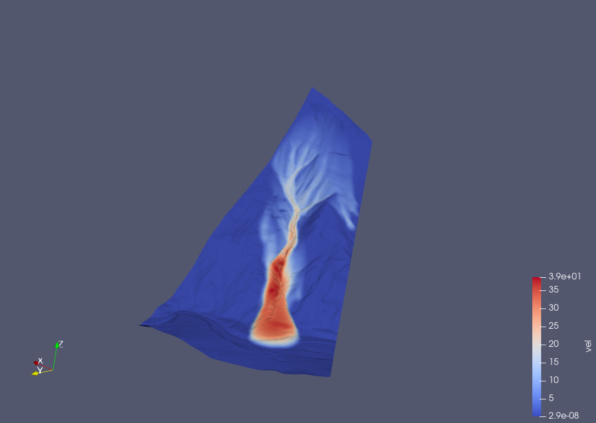
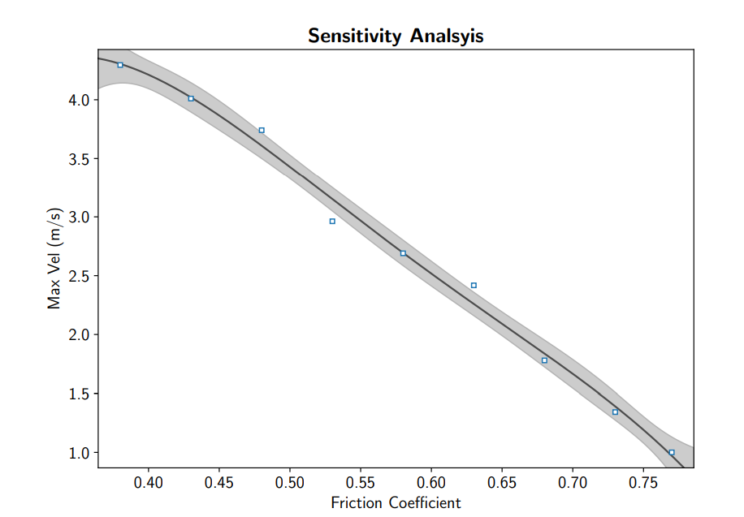

## Background 

$$
 \scriptsize \frac{\partial h}{\partial t} + \nabla \cdot (h\bar{u}) = 0 \; (1)
$$
$$
\scriptsize \frac{\partial h\bar{u}}{\partial t} + \xi\;\nabla_s\cdot (h\bar{u}\bar{u}) = 
$$

$$
\scriptsize -\frac{1}{\rho}\tau_b + h\textbf{g}_s -\frac{\alpha}{\rho}\;\nabla_s (hp_b) \; (2)
$$

$$
\scriptsize \xi\;\nabla_n\cdot(h\bar{u}\bar{u}) = h\textbf{g}_n 
$$

$$
\scriptsize  - \frac{\alpha}{\rho}\nabla_n(hp_b) - \frac{1}{\rho}\;\textbf{n}_b\;p_b \; (3)
$$

## Solution  

$$
\small \textbf{What makes a program differentiable?}
$$

&nbsp; - Continuous Flow of Execution &nbsp;  
&nbsp; - No Type Mutations &nbsp; 

$$
\small \text{Modern AD allows for user-defined rules!}  
$$

## What can be done?

## Other Applications 

- Data Driven Modelling of Avalanches
- It is an inhouse code!  

### Possible Extensions 

- Allow for non-planar discretization to handle sharp curvatures 
- Port the solver to a more general equation 

$$
\frac{\partial Q}{\partial t} + M_f\;\nabla\cdot f(Q) + M_g\nabla\;g(Q) = S(Q)
$$

::: {.column width="75%"}
*   Conservative Flux: $f(Q)$K 
*   Gradient Sources: $g(Q)$
* Constant Sources: $S(Q)$
* Parameters: $M_f\;,\; M_g$
:::
