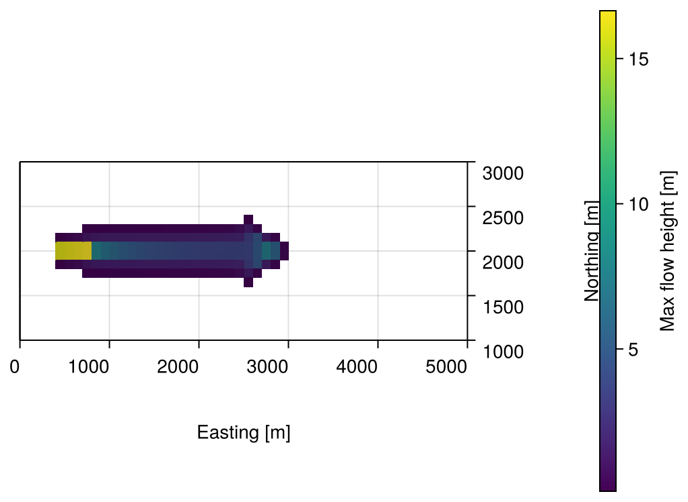
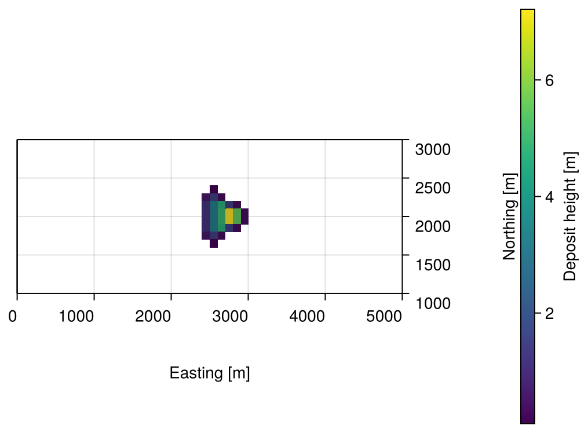

# Getting Started

```@meta
CurrentModule = GlissADe
```

*First steps are always small.*

This walkthrough runs a full simulation end to end: we release a mass of material on a slope and watch it slide downhill and come to rest as it spreads out. We use the "synthetic slope" example bundled with the repository (`examples/synthetic_slope/`), so everything below can be copied and run as is.

The mesh and release raster we use are already generated and sitting in `examples/synthetic_slope/`, so we don't need to build them ourselves.

## Initializing the library

```julia
using GlissADe

init(threads = true, stats = false, plots = false, implicit = true)
```

`threads = true` lets us use multiple threads if we start Julia with more than one (`julia --project -t 8 ...`). `implicit = true` selects the implicit (SIMPLE) solver, the one we use throughout this walkthrough.

## Parsing and precomputing the mesh

```julia
points, faces = parsemesh(
    "./examples/synthetic_slope/geometry/points",
    "./examples/synthetic_slope/geometry/faces",
    "./examples/synthetic_slope/geometry/faceLabels",
)
Cells = preprocess(points, faces, Float64, comp_neighbours = true)
```

`preprocess` computes each cell's geometry (centers, areas, normals, neighbours) once and caches it. See [Precomputing Geometry](20-tutorials/precomputing-geometry.md) for what's computed and when it's safe to skip recomputation.

## Setting the release area

We set the release from a depth raster, a grid of thickness values covering the domain. We parse it, remap it onto the mesh, and convert it to the mesh-normal thickness the solver expects:

```julia
raster = parseEsriAscii("./examples/synthetic_slope/release_depth.asc")
h0_vertical = remapRasterToMesh(raster, Cells)
h0_normal = verticalToNormalThickness(h0_vertical, Cells)
initializeGeometry(Cells, 1500.0, h0 = h0_normal, u0 = [0.0, 0.0, 0.0])
```

This assigns the raster's thickness, a material density of 1500 kg/m³, and zero initial velocity to every cell. See [Defining a Release Area from a Depth Raster](20-tutorials/defining-a-release-area.md#Defining-a-release-area-from-a-depth-raster) for how the raster is read and remapped.

## Using custom rheology models

We now define a rheology model for the friction. GlissADe supports swapping in any model whose basal stress term ``\tau_b`` is orthogonal to the flow velocity, i.e. ``\tau_b \cdot \bar{u} = 0`` (in practice, this means non-entraining models). We use the Voellmy model:

```math
\tau_b = \mu\;p_b\;\frac{\bar{u}}{\bar{u} + u_0} + \frac{\rho g}{\zeta}\lvert \bar{u}\rvert \bar{u}
```

The library treats basal friction implicitly, so a custom model is a function returning the implicit coefficient ``\mathcal{A}`` such that ``\tau_b = \mathcal{A}\bar{u}``, with a fixed signature. We give the model's two free parameters, the dry-friction coefficient ``\mu`` and the turbulent-drag coefficient ``\xi``, their own names within the function body, so they're clear rather than being magic numbers:

```julia
import LinearAlgebra: norm2

function voellmy_basal_stress(Cell, h, vel, pb, alpha, zeta, rho)
    mu = 0.16 # dry-friction coefficient
    xi = 1150.0 # turbulent-drag coefficient
    vel_mag = norm2(vel)
    vel_inv = 1.0 / (vel_mag + 1e-4)
    return vel_inv * mu * pb + rho * 9.81 * vel_mag / xi
end
```

`h`, `vel`, and `pb` are the values of the variables at a given face, and `Cell` gives us that face's full precomputed data (its geometry along with its current thickness, velocity, and basal pressure). `alpha`, `zeta`, and `rho` are passed in from the `Solution` we build next.

Pass the function to `Solution` as `basal_stress`, as shown next.

## Setting up the solver and running a simulation

We collect the model parameters and solver settings into a [`Solution`](@ref), then build a [`Solver`](@ref) from it:

```julia
solution = Solution(
    alpha = 0.5, # Coefficient for pressure thickness-averaging
    zeta = 1.25, # Coefficient for velocity thickness-averaging
    rho = 1500.0, # Material density
    alpha_p = 0.5, # Under-relaxation for pressure
    alpha_u = 0.5, # Under-relaxation for velocity
    alpha_h = 0.5, # Under-relaxation for thickness
    p_MAX_RESIDUAL = 1e-5, # Maximum allowed residual for the pressure constraint
    h_MAX_RESIDUAL = 5e-1, # Maximum allowed residual for the thickness equation
    u_MAX_RESIDUAL = 5e-1, # Maximum allowed residual for the momentum equation
    MAX_ITERS = 250, # Maximum iterations per timestep
    MIN_ITERS = 200, # Minimum iterations per timestep
    h_clip = 0.0, # Clip the thickness to 0 if h < h_clip
    h_min = 1e-3, # Minimum height to be considered wet
    Cells = Cells, # Precomputed geometry and initial conditions
    location = "./solution", # Folder to store the intermediate VTK files
    points = points, # Vertices of the mesh
    faces = faces, # Connectivity list of the mesh
    basal_stress = voellmy_basal_stress, # Custom rheology model, defined above
)

solver = Solver(solution)
```

`alpha` and `zeta` here are unrelated to `mu` and `xi` from the rheology model above: they set how pressure and velocity are averaged through the flow's thickness, not how friction behaves.

Then we [`solve`](@ref):

```julia
time_steps, sol = solve(solver, (0.0, 4000.0), saveat = 2.0, Cₘ = 4.5, rtol = 1e-4)
```

The second argument is the time span we simulate, in seconds. The solver uses adaptive timestepping based on the Courant number; `saveat` sets the uniform interval at which we save the solution regardless, and `Cₘ` caps the Courant number allowed per step.

## Post-processing

We write the solution to VTK files, ready to open in ParaView, with [`writeToVTK`](@ref):

```julia
writeToVTK(solution.location, sol, points, faces)
resetCells(Cells) # Reset all cells to zero thickness and velocity, ready for another run
```

!!! note
    `writeToVTK` deletes the contents of the given directory before saving the new files. It's recommended to use an empty directory to avoid losing other data.

Or, to skip ParaView entirely, we can render the final state directly in Julia with [`plotmesh`](@ref). This needs a Makie backend, for example `CairoMakie`, installed in our own **global** Julia environment (kept separate from the project's own environment, so the base package stays light):

```shell
julia -e 'import Pkg; Pkg.add("CairoMakie")'
```

```julia
using CairoMakie

h_final = [sol[end][5 * i - 4] for i in eachindex(Cells)]
plotmesh(Cells; field = h_final)
```

See [Visualizing a Mesh](20-tutorials/visualizing-a-mesh.md) and [Animating Mass Flow](20-tutorials/animating-mass-flow.md) for more. Here's what we get from a full run, the mass's maximum extent over the whole simulation and where it finally comes to rest:





`examples/synthetic_slope/synthetic_slope_example.jl` renders these two images itself, with a top-down camera and thin flow masked out for a cleaner picture.

And that's it. We've solved the free surface flow equations and simulated a gravity-driven shallow flow on our geometry!

## Differentiation

We can wrap every step above in a function and differentiate it with respect to any of its inputs, such as the release thickness, material density, or a rheology parameter, using automatic differentiation. See [Differentiating a Simulation](20-tutorials/differentiating-a-simulation.md) for a worked example.
