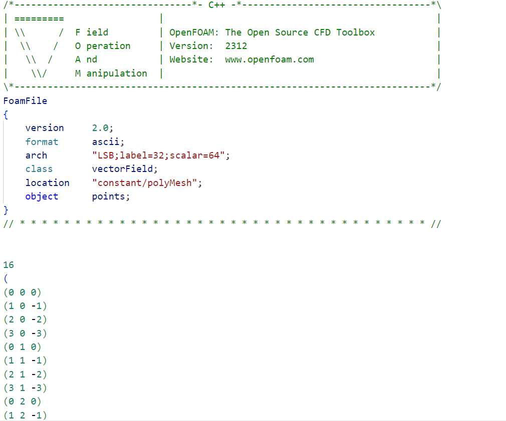
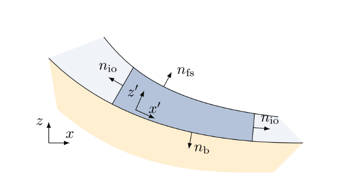
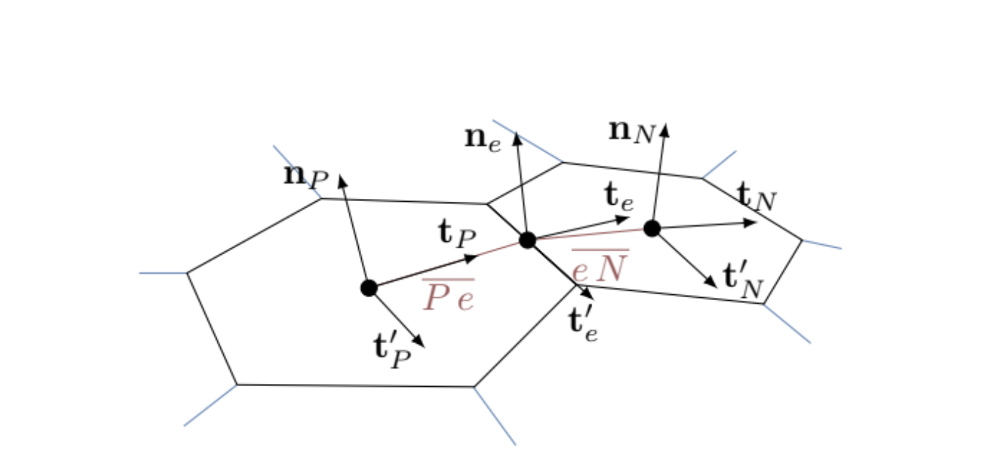
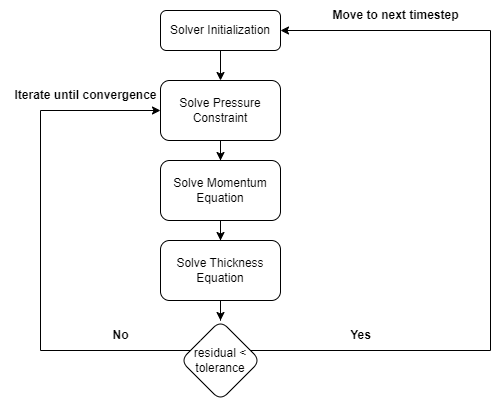

# How does the library work?

```@meta
CurrentModule = GlissADe
```

*Implementing a solver is easy until you have to do it yourself.*

This page gives a detailed overview on the working of the library, mainly the finite area mesh generation, mesh parsing and preprocessing, release area set-up, and the solution process. Almost all parts of the library are naturally forward-mode differentiable without the need for defining custom rules. Custom rules are defined for the solution of linear systems, as the SciML library [`LinearSolve.jl`](https://github.com/SciML/LinearSolve.jl) doesn't fully support the use of Dual numbers yet.

!!! note
    See [Jacobians and the DCM Derivation](jacobians.md) for an explanation of why jacobians are ignored for mild curvatures.

The library was written with the intention to reduce complexity for the end user, and as such abstracts away complex details behind simple functions. Simple data structures are used to allow the user to interface with the library without changing the source code, giving an "OpenFOAM"-like style to the solver. Default datatypes are defined in the module definition file [`GlissADe.jl`](https://github.com/thealanjason/GlissADe.jl/blob/main/src/GlissADe.jl), used for variables left uninitialized by the user. The abbreviations `FLOAT_TYPE` and `INT_TYPE` use Julia's built-in `Float64` and `Int64` datatypes as defaults. Owing to issues with other floating point formats, only the `Float64` type is supported. Other integer types such as `Int32` or `Int16` can also be used to store integer variables, particularly "face" information and neighbours. [`ForwardDiff.jl`](https://github.com/JuliaDiff/ForwardDiff.jl) is used for forward-mode automatic differentiation.

## Mesh Generation

Rauter and Toković (2018) developed an all-in-one library for avalanche simulations using the OpenFOAM framework. This library is [open-source](https://develop.openfoam.com/Community/avalanche). OpenFOAM's `polyMesh` and `makeFaMesh` functionalities allow for generating finite area meshes for any given topography.

One advantage of the mild surface assumption is that the surface can be discretized with convex planar elements, which reduces computational requirements as compared to handling non-planar geometry.

## Initializing the Library to perform computations

To initialize the library, the [`init`](@ref) function is called with keyword arguments describing how the simulation process should be run: `threads` allows the user to toggle multithreading wherever possible; `stats` prints intermediate information regarding the simulation process such as timestep taken and residuals; `plots` toggles side-by-side plotting for intermediate data during the simulation process, using Julia-wrapped [`PyPlot.jl`](https://github.com/JuliaPy/PyPlot.jl); `float_type` and `int_type` set the fallback types for floating-point and integer variables.

## Parsing the Mesh

OpenFOAM's `polyMesh` and `makeFaMesh` utility writes the mesh in structured text files which can be easily parsed, even without using regular expressions (ReGex). Three example meshes are present with the library: an inclined plane surface, a mildly curved slope, and the wolfsgrube terrain.

An example [line in the "points" file](https://github.com/thealanjason/GlissADe.jl/blob/main/examples/simpleslope/simpleslope/points) for a mildly curved slope, representing a vertex in 3D space:

```text
(0.682627 -20 -0.47798)
```

Similarly, the "faces" file gives the connectivities for the mesh, i.e. which vertices are connected to form a convex polygon. An example [line in the "faces" file](https://github.com/thealanjason/GlissADe.jl/blob/main/examples/simpleslope/simpleslope/faces) for a mildly curved slope which gives the indices forming a closed and convex polygon:

```text
4(120 122 123 121)
```

Notice the number outside the parenthesis. It gives the number of edges in the polygon. This is useful when parsing to check if all indices are correctly passed. The "faceLabels" file gives the indices of the polygons which form the surface. This is useful to extract only the necessary points and connectivities from the "points" and "faces" file.

Here's an example [points](https://github.com/thealanjason/GlissADe.jl/blob/main/examples/simpleslope/simpleslope/points) file that the library's parser expects.



The file parser returns arrays of "points", "faces", and "faceLabels". The [parser's source code](https://github.com/thealanjason/GlissADe.jl/blob/main/src/module/parser/parser.jl) is on GitHub. The parser is accessed internally by the [`parsemesh`](@ref) function exposed to the user. It will automatically parse and perform reordering for the data extracted.

## Geometry Precomputation

The "points" and "faces" arrays returned by the parser are filtered using the indices given in "faceLabels". The filtering algorithm can be described as follows:

1. Compute the faces on the surface:

```math
F_S = \lbrace f; f \in faceLabels\rbrace
```

1. Compute the points on each face computed in step 1:

```math
\forall f \in F_S\;P_f = \lbrace p ; p \in f \rbrace
```

1. Compute the points on the surface:

```math
P_S = \bigcup\limits_{f\;\in\;F_S} P_f
```

A simple renumbering scheme is followed to reorder the vertices. This avoids the need for maintaining a search structure at run-time to find the correct vertex given an index.

Using the points on the surface and their connectivities, a list of geometrical information used further on can be computed. This section describes all the computations made for the solution procedure.

Before moving further, here's the spatially discretized form of the pressure constraint equation:

```math
\frac1{\rho}p_P^n\;\mathbf{n}_P\;S_P + (\mathbf{n}_P\;\mathbf{n}_P)\cdot\xi \sum_{e} \mathbf{m}_e\cdot h_e^{*} \bar{\mathbf{u}}_e^{*}\bar{\mathbf{u}}_e^{*} L_e = (\mathbf{n}_P\mathbf{n}_P)\cdot h_P^{*}\;\mathbf{g}\;S_P
```

```math
-\;(\mathbf{n}_P\;\mathbf{n}_P)\cdot\frac\alpha\rho\sum_{e}\mathbf{m}_e\;h_e^{*}\;p_{e}^{*}L_e
```

Even though this equation seems daunting, the structure is simple. Let's check what is required from the geometry. The first and third terms require the surface normal and the area for element `P`. The second and fourth terms require the surface normal, edge lengths, and the edge binormals for element `P`.

The second and fourth terms depend on the values at edge centers, which shows the coupling between neighbouring elements. The required information per element can therefore be described as:

- vertices: Coordinates of all vertices (points) of element `P`
- center: Coordinates of the center of element `P`
- id: Index of element `P` in the mesh (after filtering)
- edge centers: Coordinates of all edge centers of element `P`
- edge lengths: Lengths of all edges of element `P`
- normal: Surface normal of element `P` at `center`
- area: Area of the region covered by element `P` on the surface
- edge binormals: Orthogonal vectors to the edges, pointing outwards of the edge center
- neighbours: Indices of neighbouring elements of element `P`
- transforms: Transformation matrices, described later

This corresponds directly to the [`Cell`](@ref) structure used throughout the library. Following the list above, here's an ordered description for each computation for element `P`.

### Face Centers `center`

The center of a planar and convex polygon is simply the arithmetic mean of all its vertices. Thus, the coordinates for the center are simply:

```math
\mathbf{C} = \frac{\sum_{\mathbf{v}\;\in\;vertices}\;\mathbf{v}}{N}
```

where `N` is the number of vertices.

### Edge Centers `edge_centers` and Edge Lengths `edge_lengths`

The center and length of an edge is simply the midpoint and the distance between the connected vertices. In other words,

```math
\mathbf{C}_e = \frac{\mathbf{V}_1 + \mathbf{V}_2}{2}
```

```math
L_e = \lvert \lvert \mathbf{V}_2 - \mathbf{V}_1 \rvert \rvert
```

### Surface Normal `normal`

Computing the surface normal at the center is a bit tricky. For a planar surface, the surface normal can be calculated by taking any two non-parallel vectors ``\mathbf{P}`` and ``\mathbf{Q}`` and finding their cross-product. The direction should be adjusted based on requirements; in this case, it is expected to find the normal which points inward of the surface, best visualized from Rauter's work. The vector in question is ``n_b``.



Thus,

```math
\mathbf{n}_P = -\frac{\mathbf{PV}_1 \times \mathbf{PV}_2}{\lvert\lvert \mathbf{PV}_1\times\mathbf{PV}_2\rvert\rvert}
```

where ``P`` is the center of the element as described in [Face Centers](#face-centers-center).

### Area

Computing the area of a convex planar polygon is simple. There are two ways to compute the area:

- Divide and Sum
- Gauss Theorem

#### Divide and Sum

This is the most intuitive way to compute the area of a planar convex polygon. In general, the area bounded by a triangle ``\triangle \mathbf{ABC}`` is given by:

```math
area(\triangle \mathbf{ABC}) = \frac{\lvert \lvert \mathbf{AB}\times\mathbf{AC} \rvert \rvert}{2}
```

Then, to compute the area of any given planar polygon, the polygon is divided into triangles and the area is summed up to give the area bounded by the polygon.

#### Using Gauss Theorem

This is a pretty smart trick to find the area of a polygon. This is generally used for skewed 3D volumes, but can be developed similarly for 2D planar surfaces. The Gauss Divergence theorem states that for any vector field ``B``, the following holds:

```math
\int_{V}(\nabla\cdot\mathbf{B}) = \oint_{S = \partial V} (\mathbf{B}\cdot\hat{n}) dS
```

Similarly, for a 2D planar surface,

```math
\int_{S}(\nabla\cdot\mathbf{B}) = \oint_{L = \partial S}(\mathbf{B}\cdot{\hat{n}}) dL
```

To compute the area, consider a vector field ``\mathbf{B}`` such that ``\nabla\cdot\mathbf{B}=1``, then

```math
S_P = \oint_{L=\partial S} (\mathbf{B}\cdot\hat{n}) dL \approx \sum_{e\in\;\text{edges}} \int_L (\mathbf{B}\cdot\hat{n}) dL
```

where the line integral along the boundary of the surface is broken into integrals of the edges of the discretized polygonal element. Consider the field ``\mathbf{B} = \frac13 (x,y,z)``; its divergence is:

```math
\nabla\cdot\mathbf{B} = \frac13 (\frac{\partial}{\partial x}, \frac{\partial}{\partial y}, \frac{\partial}{\partial z})\cdot(x,y,z) = \frac13 (1+1+1) = 1
```

Using this field, the area of the polygon can be written as:

```math
S_P \approx \sum_{e\in\;\text{edges}} \int_L (\mathbf{B}\cdot\hat{n}) dL \approx \sum_{e\in\;\text{edges}} (\mathbf{B}_e\cdot\hat{n}_e)\;L_e = \sum_{e\in\;\text{edges}} (\frac13 (x_e, y_e, z_e) \cdot\hat{n}_e)\;L_e
```

where ``(x_e,y_e,z_e)`` are the coordinates of the edge center and ``\hat{n}_e`` is the surface normal at the edge center of edge ``e``. Though a bit more complex, the running-time complexity of both algorithms is the same: ``\mathcal{O}(E)`` where ``E`` is the number of edges in element ``P``.

### Neighbours `neighbours`

Computing the neighbours of a mesh from the connectivity list for the vertices is difficult. There are different algorithms, some efficient, some slower, for computing neighbours. The easiest option is to just parse the "neighbours" file generated by OpenFOAM, but understanding OpenFOAM's structure for that file is inconvenient. Instead, a simple yet inefficient algorithm is implemented:

1. Generate the point-element map: which vertex is part of which elements?
    - For all vertices ``V`` and faces ``F`` part of the terrain, define a set ``M_v`` such that
        - ``M_v`` = ``\lbrace f; v \in f, f \in F \rbrace``

    The set ``M_v`` is the point-element map ``\forall\;\text{vertices}\;v \in V``.

2. Find common edges to find neighbours
    - Algorithm:
        - ``\forall`` ``F \in`` Elements
            - Define set containing neighbours of F: ``N_F = \lbrace \rbrace``
            - ``\forall P \in F``
                - let N = ``P+1``, i.e. the next vertex in clockwise order.
                - Faces containing ``P``: ``S_P = M_P``
                - Faces containing ``N``: ``S_N = M_N``
                - Faces containing both ``P`` and ``N \rightarrow`` the edge ``\overline{PN}``: ``\; SS_F = S_P \cap S_N``
                - Neighbour to ``F``: ``n_F = SS_F - \lbrace F \rbrace``
                - ``N_F = N_F \cup \lbrace n_f \rbrace``

Since in a "quasi"-planar geometry, i.e. that of planar manifolds in 3D, the edge is shared by only the owner and one neighbouring cell, the neighbours can be easily found. The algorithm first computes the point-element map, which stores the indices of elements that a vertex is part of. Using this map, step 2 computes the elements sharing vertices ``P`` and ``P+1``, i.e. elements which share the edge connecting ``P`` and ``P+1``. For planar geometry, the set of elements containing this edge is ``\lbrace F, n_f \rbrace``; if the edge is at the boundary, the set contains just ``F``, a singleton.

The runtime complexity of this algorithm is bounded by step 1, which has complexity ``\mathcal{O}(PE)`` where ``P`` is the number of vertices and ``E`` is the number of elements. Step 2 has complexity ``\mathcal{O}(E(P/E)) = \mathcal{O}(P)`` as the average number of edges per element is approximately ``P/E``, giving an overall complexity for this algorithm of ``\mathcal{O}(PE)``. As each element will typically contain around 10-20 vertices, ``P = \mathcal{O}(E)``, thus ``\mathcal{O}(PE) \approx \mathcal{O}(E^2)``. This makes it the most expensive precomputation to be done.

However, this computed information is dependent entirely on the mesh and not on the release geometry, and can be stored to disk to increase speed in subsequent computations. `comp_neighbours` is an optional argument passed to the [`preprocess`](@ref) function to write to and read from disk if set to `false`. If `comp_neighbours = true`, neighbours will be computed even if stored files on disk exist.

### Edge Binormals `edge_binormals` and Transforms `transform`, `transform2`

The final precomputation to be done from geometry is to compute the edge binormals and the transformation matrices. Since the curvature is not constant throughout the surface, vectors cannot be interpolated directly in global coordinates and need to be interpolated in local coordinate systems to preserve the surface-tangentiality of the flow. In other words, the velocity at the edge common to elements ``P`` and ``N`` is:

```math
\mathbf{u}_e = \mathbf{T}_e^{-1}(e_x \mathbf{T}_P \mathbf{u}_P + (1-e_x) \mathbf{T}_N \mathbf{u}_N)
```

As established earlier, the elements are planar. Thus, the transformation matrices to transform a vector from global to local coordinates are just the Direction Cosine Matrix (DCM). A DCM is an orthogonal matrix having the property ``M^{-1} = M^T``. This leads to the following relation:

```math
\mathbf{u}_e = e_x \mathbf{T}_e^T\mathbf{T}_P\mathbf{u}_P + (1-e_x)\mathbf{T}_e^T\mathbf{T}_N\mathbf{u}_N = e_x \mathbf{T}_1\mathbf{u}_P + (1-e_x)\mathbf{T}_2\mathbf{u}_N
```

The fields `transform` and `transform2` store the transformation matrices ``\mathbf{T}_1`` and ``\mathbf{T}_2`` for each edge. Here is another figure from Rauter's work:



The figure shows that the element consists of only six vertices. But that is not true in general; the elements are not expected to follow any rules other than being planar and regular. Thus, the binormals should not depend on geometrical information which is dependent on the number of vertices. The edge binormal ``\textbf{t}_e`` in the figure is simply the cross product of the normal at the edge ``\textbf{n}_e`` and the edge ``\textbf{e}`` (``t_e'`` in the figure) itself. Thus, following the right-hand rule, ``\mathbf{t}_e = \mathbf{n}_e \times \mathbf{e}``. This completes the precomputation.

The [`preprocess`](@ref) function performs the necessary precomputations and mesh index reordering using the [Reverse-Cuthill-McKee](https://en.wikipedia.org/wiki/Cuthill%E2%80%93McKee_algorithm) algorithm. The [source code for the geometrical precomputations](https://github.com/thealanjason/GlissADe.jl/blob/main/src/module/geometry/geometry.jl) is on GitHub.

## Defining the Release Area

The release area is the region initialized with a nonzero thickness `h` at the start of a simulation. It can be given in two ways. Given a rectangular region defined by ``\lbrack x_{min}, x_{max}, y_{min}, y_{max} \rbrack``, a regular polygon is found lying completely inside it, and every face inside that polygon is initialized with a single user-defined thickness. Alternatively, a depth raster (an ESRI ASCII grid) can be conservatively remapped onto the mesh, giving each face its own thickness derived from the raster instead of one uniform value. See [Defining a Release Area](../20-tutorials/defining-a-release-area.md) for both.

The [source code](https://github.com/thealanjason/GlissADe.jl/blob/main/src/module/initialConditions/initialConditions.jl) contains all the related functions.

## Solving the equations

Here comes the real deal: solution of the equations. Following the sequential approach typically used, and as described by Rauter and Toković (2018), the flowchart can be shown as:



Firstly, the pressure constraint equation is used to solve for pressure satisfying the constraint, and is treated explicitly. This is used to update the momentum, followed by the thickness, which are treated implicitly. This procedure is iterated over and over until convergence is achieved. The [`Solution`](@ref) structure takes input from the user for the parameters controlling this process.

Under-relaxation is performed to reduce oscillations of the solution. `alpha_p`, `alpha_h`, and `alpha_u` are under-relaxation parameters. The field `basal_stress` allows the user to use their own rheology model. Fields `h_min` and `h_clip` are used to determine whether a face should be considered dry or not, and whether the thickness should be clipped once below a certain value `h_clip`. `MIN_ITERS` is used to allow a minimum number of corrections to be completed before moving on to the next time step, and `MAX_ITERS` limits the total number of corrections performed, i.e. if `MIN_ITERS = 3` and `MAX_ITERS = 10`, then the solver will perform at least 3 corrections and at most 10 corrections per timestep.

The `location` field is the location of the directory the files need to be stored at; the current implementation restricts the location to a simple format as given in the default value: `"./<foldername>"`. `alpha`, `zeta`, and `rho` are the model parameters; `p_MAX_RESIDUAL`, `h_MAX_RESIDUAL`, and `u_MAX_RESIDUAL` are the maximum allowed residuals in the solution of the pressure constraint equation, the thickness "continuity" equation, and the momentum equations.

### Differencing schemes

Before moving further with the formulation of the differencing scheme used, it is better to understand some physical properties of the system. The governing equations for the flow show that it is convection dominated. Irrespective of the distribution of velocity in the domain, the convection term always remains within the bounds specified by the initial conditions. If, for example, the initial distribution has ``0 \leq h(0) \leq 0.5``, then the solution at any time ``h(t)`` always maintains ``0 \leq h(t) \leq 0.5``, i.e. the convection term will never yield values lower than zero or higher than ``0.5``. Therefore, it is essential to preserve this property in the discretized form as well.

## Performance Micro-Optimizations & Lock-Free Architecture

GlissADe.jl incorporates state-of-the-art CPU performance micro-optimizations to maximize simulation throughput and minimize memory allocation:

1. **Lock-Free Thread-Local Caching**: Replaced dynamic `Channel{Cache}` thread locks with thread-indexed `caches[Threads.threadid()]` workspace arrays, eliminating synchronization locks during parallel solves.
2. **Positional `@inline` Interpolation Stencils**: Spatial interpolators (`centralInterpolate!`, `upwindInterpolate!`, `gamma!`, `GreenGaussGradient!`) utilize `@inline` annotations and positional argument dispatch to eliminate keyword-tuple packing in tight face loops.
3. **Gustafsson PID Step Size Control**: Adaptive Runge-Kutta 5(4) (`:rk45`) employs a PI step size controller ($q_1=0.14$, $q_2=0.08$ with historical error tracking) to eliminate timestep chattering and step rejections near sharp flow fronts.
4. **SIMD Vectorization & Hardware FMA Inlining**: Spatial RHS flux loops in `computeRHS!` are annotated with `@fastmath @inbounds` and utilize fused multiply-add `muladd(a, b, c)` hardware primitives for SIMD execution on x86 AVX2/AVX-512 and ARM NEON architectures.
5. **Compact BitVector Dry-Cell Masking**: Maintains a 1-bit-per-cell `BitVector` dry-cell status mask for bitwise SIMD evaluation during stage sync loops.
6. **Concrete Type Stability**: All solver structs (`Cache`, `Cell`, `Solver`) are fully concretely typed (`T, S, W`), avoiding hidden `Any` type boxing.

The role of a differencing scheme is to determine the value at edges from the values available at face centers. For the arbitrarily unstructured mesh used in the solver, it is efficient to only use values of the face and its immediate neighbours, as this removes the overhead of storing additional information.

The simplest differencing scheme is the one which follows the linear profile, known as linear or central differencing:

```math
\phi_e = f \phi_P + (1-f) \phi_N
```

This scheme is second order accurate. However, according to [Godunov's theorem](https://en.wikipedia.org/wiki/Godunov%27s_theorem), any scheme higher than first order is expected to have numerical oscillations, causing instability in the system. Another popular differencing scheme is the upwind scheme:

```math
\phi_e = \begin{cases}
            \phi_P ; \; \text{Flux} \geq 0 \\
            \phi_N; \; \text{Flux} < 0
            \end{cases}
```

This scheme is first order accurate. Although less accurate, this scheme is used to provide numerical diffusion and stability to the solution. To solve the implicit equations, the equations are linearized and the last updated value is used as an initial guess for the variables. The equations can then be written in the "famous" form:

```math
\mathbf{A}\mathbf{x} = \mathbf{b}
```

### Solving Ax=b

To solve this system of equations, iterative methods are often preferred. For convergence, iterative methods require the diagonal dominance of the matrix ``\mathbf{A}``. To ensure diagonal dominance of the matrix, a "switching" scheme dependent on the flux is used for differencing:

```math
\text{Interpolation} = \begin{cases}
            \text{Central Interpolation} ; \; \text{Flux} \geq 0 \\
            \text{Upwind Interpolation} ; \; \text{else}
            \end{cases}
```

This scheme lies somewhere between first and second order but is stable, as it ensures that the coefficient matrix ``\mathbf{A}`` is always diagonally dominant. It can be easily shown that this scheme preserves the "boundedness" property discussed above. However, the scheme is also prone to oscillation, and under-relaxation is used to reduce oscillation and smooth the convergence process.

The coefficient matrix ``\mathbf{A}`` is preconditioned using a Jacobi preconditioner (diagonal preconditioning) followed by an Incomplete-LU zero fill-in, implementation of which is provided by [`ExtendableSparse.jl`](https://github.com/j-fu/ExtendableSparse.jl), and solved using the Krylov subspace based Generalized Minimum Residual method (GMRES) provided in [`LinearSolve.jl`](https://github.com/SciML/LinearSolve.jl) under the name `KrylovJL_GMRES`.

Dry cells are handled at the matrix level itself, following Rauter and Toković (2018). The field `h_min` is used as a threshold to determine whether a cell is marked dry or not.

The solution for the thickness is clipped to always be ``\geq \text{h}_{\text{clip}}``.

The code is naturally differentiable at almost every step: computing timesteps, residuals, and the assembly of the system of equations. However, [`LinearSolve.jl`](https://github.com/SciML/LinearSolve.jl) doesn't yet fully support [`ForwardDiff.jl`](https://github.com/JuliaDiff/ForwardDiff.jl), leading to a problem in automatic differentiation. Instead, custom rules are defined as follows. The coefficient matrix ``\mathbf{A}``, the solution vector ``\mathbf{x}``, and the source ``\mathbf{b}`` are all functions of the topography (vertices of the mesh, model parameters, and the initial conditions), call ``\mathbf{p}``, and can be expressed as:

```math
\mathbf{A}(\mathbf{p})\;\mathbf{x}(\mathbf{p}) = \mathbf{b}(\mathbf{p})
```

``\forall p_i \in \mathbf{p}``, take a derivative w.r.t. ``p_i``:

```math
\mathbf{A}\frac{\partial \mathbf{x}}{\partial p_i} + \frac{\partial \mathbf{A}}{\partial p_i}\mathbf{x} = \frac{\partial \mathbf{b}}{\partial p_i}
```

Rearranging the equation reveals the solution to our problem:

```math
\mathbf{A}\frac{\partial \mathbf{x}}{\partial p_i} = \frac{\partial \mathbf{b}}{\partial p_i} - \frac{\partial \mathbf{A}}{\partial p_i}\mathbf{x}
```

or simply,

```math
\mathbf{A}\frac{\partial \mathbf{x}}{\partial p_i} = \mathbf{b}^{'}
```

The derivatives are the solution of a different system of linear equations which have the same coefficient matrix ``\mathbf{A}``. This leads to reusing the factorization for the matrix ``\mathbf{A}`` and storing it in cache, leading to a performance boost. The algorithm for computing the derivative scales linearly, i.e. the time complexity is ``\mathcal{O}(N_p\times\text{TimeLinearSolve})`` where ``N_p`` is the number of parameters in the vector ``\mathbf{p}``. This leads to an increase in computational workload per linear solve, making it inconvenient to use when the number of parameters is large, i.e. when differentiating w.r.t. the topography. The partial derivatives for the coefficient matrix ``\mathbf{A}`` and the source ``\mathbf{b}`` are computed during the assembly, leading to the computation of partial derivatives throughout the computational pipeline.

## Conclusion

In conclusion, details were given on the computation of the geometrical quantities, on the initial condition and solver setup, and finally on the solution of the system of linear equations. Ensuring a "continuous" workflow throughout leads to differentiable code, i.e. no conditionals and jumps such as early returns will be differentiable. Conditionals of unrelated variables are allowed, i.e. the conditional `iters < MAX_ITERS` is allowed, but the conditional `h > h_min` will lead to incorrect derivatives. A brief overview was given of the differencing schemes used for the solver and of the custom rules defined to compute the derivatives of the solution of linear systems.
