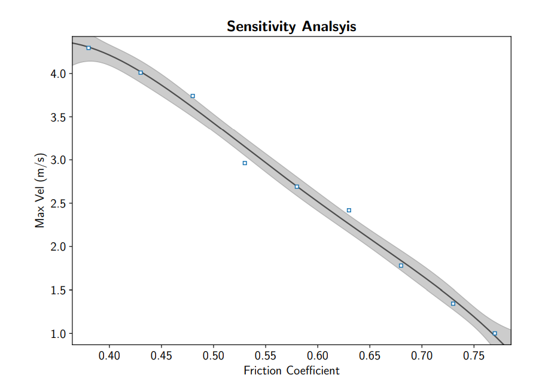

## GlissADe.jl {background-color="#1a1a1a"}

A differentiable shallow-flow solver for avalanches, landslides, and floods

[image here: title slide graphic, e.g. an avalanche or debris flow photo]

## Why this matters

- Avalanches, landslides, and floods threaten infrastructure and lives. Hazard maps and inundation forecasts guide where we build and how we evacuate.
- Simulators like OpenFOAM-Avalanche, AvaFrame, and r.avaflow already produce these forecasts, and they're solid tools.
- What they can't do well: tell you how sensitive their prediction is to a parameter you're unsure about, or fit that parameter to observed data, without brute-forcing it one run at a time.

[image here: hazard map or inundation zone example]

## The gap: gradients

- Sensitivity analysis, calibration, and inverse problems all come down to the same question: how does the output change if I nudge an input?
- The standard way to answer that is finite differences: rerun the whole simulation once per input, perturbed a little. This gets expensive fast as the number of inputs grows.
- Automatic differentiation answers the same question in close to the cost of one run, no matter how many inputs you're asking about.
- GlissADe.jl adds this capability to a shallow-flow solver built on a real depth-integrated model, not a toy.

## The governing equations

- Built on the surface-aligned, depth-integrated Savage-Hutter equations from Rauter and Tuković [@rauter2018].
- Mass and momentum balance, written on a curved surface rather than a flat plane, so it can handle real terrain.

$$
 \scriptsize \frac{\partial h}{\partial t} + \nabla \cdot (h\bar{u}) = 0 \; (1)
$$
$$
\scriptsize \frac{\partial h\bar{u}}{\partial t} + \xi\;\nabla_s\cdot (h\bar{u}\bar{u}) =
$$

$$
\scriptsize -\frac{1}{\rho}\tau_b + h\textbf{g}_s -\frac{\alpha}{\rho}\;\nabla_s (hp_b) \; (2)
$$

$$
\scriptsize \xi\;\nabla_n\cdot(h\bar{u}\bar{u}) = h\textbf{g}_n
$$

$$
\scriptsize  - \frac{\alpha}{\rho}\nabla_n(hp_b) - \frac{1}{\rho}\;\textbf{n}_b\;p_b \; (3)
$$

## How the solver is built

- A Finite Area Method, the same style OpenFOAM uses for its `faMesh`: cell-centered fields on an unstructured mesh.
- Each time step is a segregated solve: update pressure, then momentum, then thickness, iterating until it converges.
- Every implicit update boils down to solving a sparse linear system.

## How we made it differentiable

- Every field in the solver (thickness, velocity, pressure) is generically typed, so when you hand it a `Dual` number, the whole solve just works. No rewrite needed.
- The one place that doesn't come for free: the linear solve. Running dual numbers through an iterative solver like GMRES is wasteful and can be numerically shaky.
- Instead, we differentiate the equation $Au = b$ directly: $A\,du/dx = db/dx - (dA/dx)\,u$, and solve that using the factorization we already computed for the primal solve. This is a known technique (see @martinsning2021, the "AD shortcuts for matrix operations" section), and it's the part of the code we're proudest of.

## Handling the awkward parts

- Real solvers have kinks that autodiff is supposed to hate: switching between upwind and central differencing depending on flow direction.
- It turns out fine here: dual numbers pick the branch by the sign of their value, same as a plain float would, so the derivative comes out right without any special-casing.
- In-place updates (`.=`, `+=`) on the state arrays are no problem either, since it's all just operator overloading under the hood.
- We check this isn't just a nice theory: every gradient we compute is validated against finite differences in the test suite.

## Demo: sensitivity analysis

- Example: maximum flow velocity as a function of the basal friction coefficient, computed on the simpleslope case.
- To be clear about scope: this is a sensitivity study of a physical parameter, not a full uncertainty quantification of terrain. That's further out, see the last slide.

## Where this stands today

- Forward-mode only. Cost grows with the number of things you differentiate with respect to, so this is great for a handful of parameters, not for thousands of mesh nodes.
- The linear solve runs on a single core. The Krylov iteration is inherently sequential, and the ILU preconditioner's triangular solves have a row-by-row dependency chain that isn't parallelized here.
- Only planar mesh elements are supported, so sharp terrain curvature isn't handled yet.
- This started as a research internship project. It's a working prototype that proves the idea, not a production tool yet.

## Where this could go

- Reverse-mode AD via Enzyme.jl, with custom rules for the linear solve (the adjoint counterpart to what we built, see @martinsning2021 on direct vs. adjoint methods). This is what would make differentiating w.r.t. thousands of terrain points tractable.
- The N sequential solves per gradient direction are independent of each other and could run in parallel, once the solver's shared workspace is refactored to allow it.
- Topographic uncertainty quantification is the natural next step, but it raises a real question first: DEM uncertainty comes as a raster grid, while the solver's state lives on an unstructured mesh. Mapping one onto the other introduces its own error. Worth asking whether a structured-grid solver would be a better fit than sticking with the Finite Area Method.
- A more general conservation-law form, so the solver isn't limited to this one physical model:

$$
\frac{\partial Q}{\partial t} + M_f\;\nabla\cdot f(Q) + M_g\nabla\;g(Q) = S(Q)
$$

::: {.column width="75%"}
*   Conservative flux: $f(Q)$
*   Gradient sources: $g(Q)$
*   Constant sources: $S(Q)$
*   Parameters: $M_f\;,\; M_g$
:::
