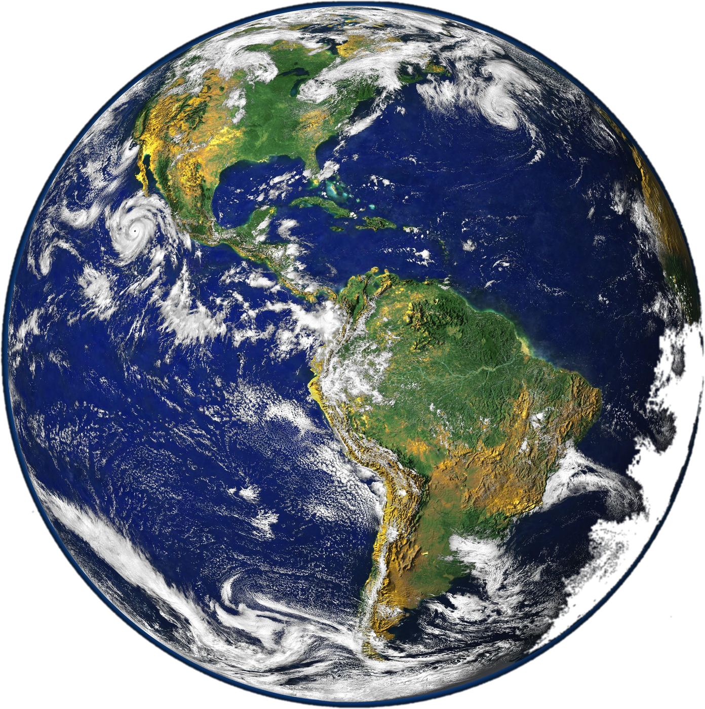
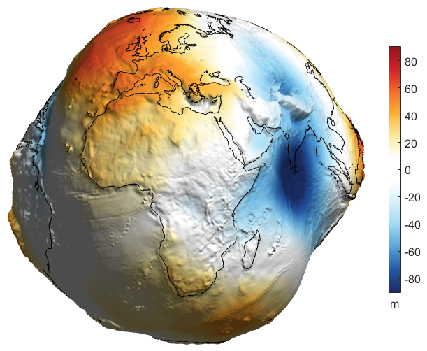
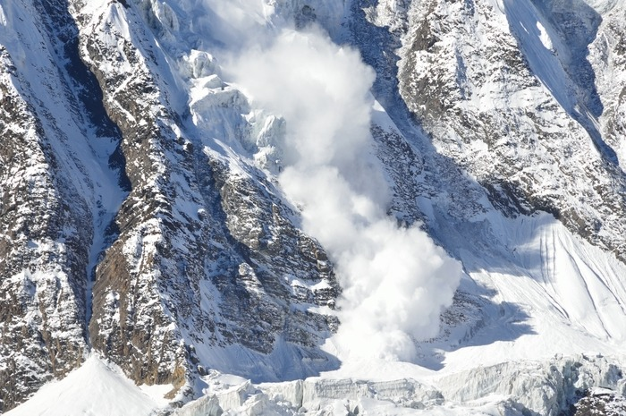
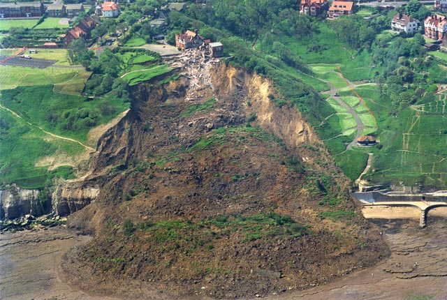
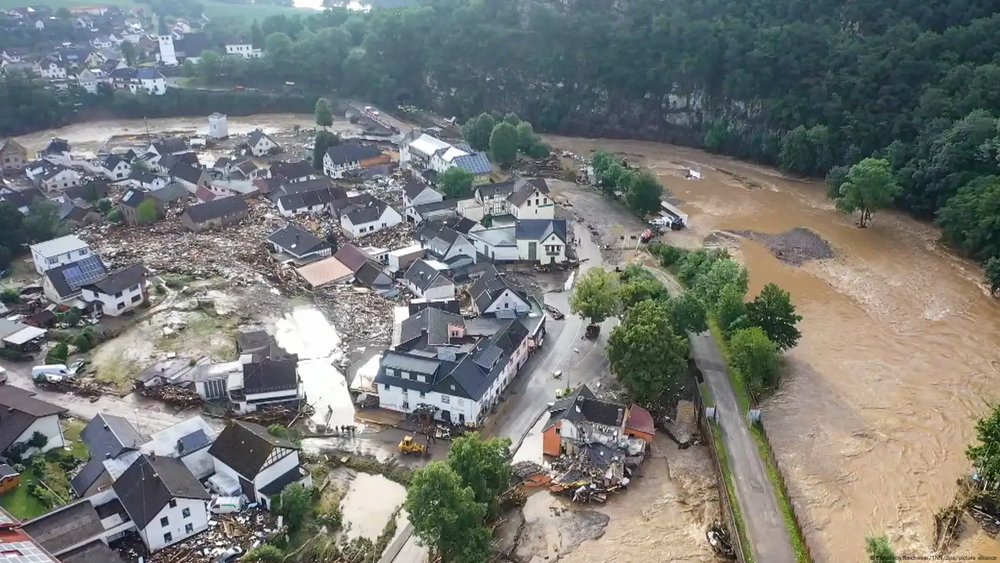
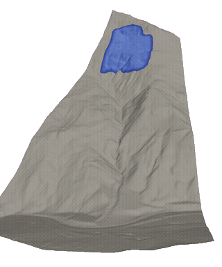
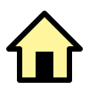
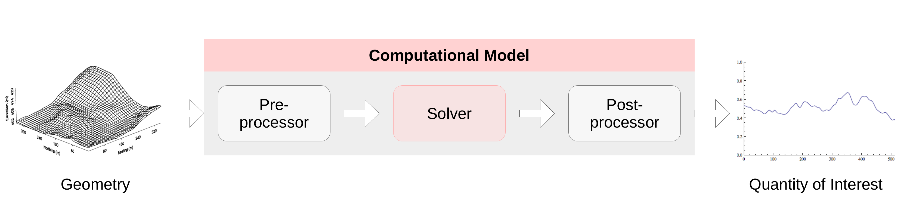
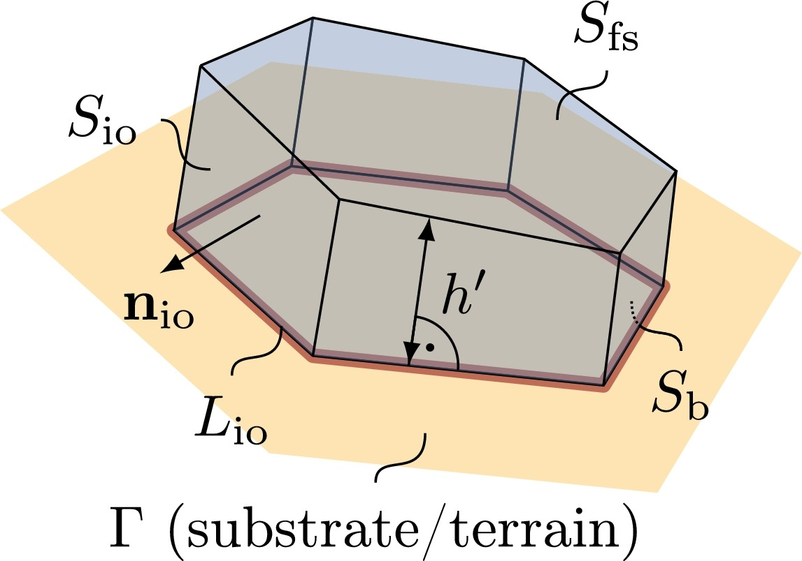
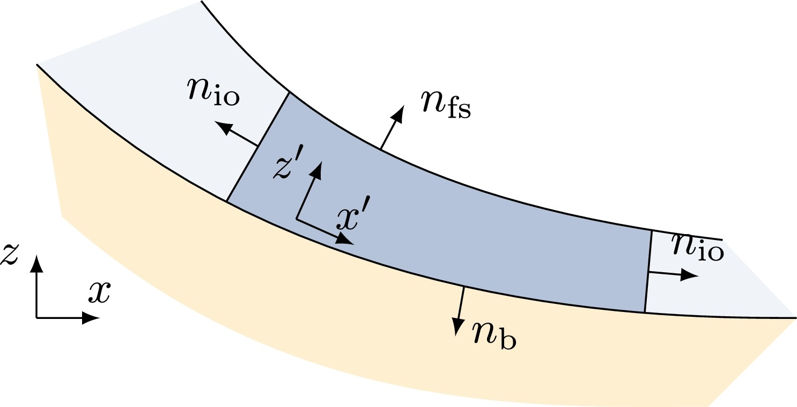

## How Spherical is the Earth?

Topographic Uncertainty

Left: NASA Blue Marble, Wikimedia Commons. Right: Geoid height (EGM2008, nmax=500), P. Bezděk, Astronomical Institute, Czech Academy of Sciences.

::: {.notes}
NASA Blue Marble (left, background removed) vs. EGM2008 geoid height (right, exaggerated). Until we had a precise measurement of the geoid, the Earth's true shape was represented as a sphere plus some uncertainty around it. Once we measured it directly, that uncertainty collapsed into known geometry.
:::

## Modeling and Simulation for Geohazards

::: {.columns}

::: {.column width="33%"}
::: {.geohazard-source}
https://www.theuiaa.org/
:::
::: {.geohazard-img}

:::
::: {.geohazard-caption}
Avalanches
:::
:::

::: {.column width="33%"}
::: {.geohazard-source}
https://www.bgs.ac.uk/
:::
::: {.geohazard-img}

:::
::: {.geohazard-caption}
Landslides
:::
:::

::: {.column width="33%"}
::: {.geohazard-source}
https://www.thenationalherald.com/
:::
::: {.geohazard-img}

:::
::: {.geohazard-caption}
Flash Floods
:::
:::

:::

::: {.fragment style="text-align: center;"}
{width=90%}

Hazard-map result: [@zhao2020]

:::

::: {.notes}
- Avalanches, landslides, and floods threaten infrastructure and lives. Hazard maps and inundation forecasts guide where we build and how we evacuate.
- Simulators like OpenFOAM-Avalanche, AvaFrame, and r.avaflow already produce these forecasts, and they're solid tools.
- What they can't do well: tell you how sensitive their prediction is to a parameter you're unsure about, or fit that parameter to observed data, without brute-forcing it one run at a time.
:::

## The Challenge

Uncertainty Informed Predictions

::: {.columns .challenge-row}

::: {.column width="45%"}
::: {.challenge-flow}

:::

OpenFOAM-Avalanche [@rauter2018]

:::

::: {.column width="55%"}
::: {.challenge-box-flex}
::: {.challenge-box .fragment}
::: {.challenge-header .header-blue}
Monte-Carlo (MC) Method
:::
::: {.challenge-body}
- [+]{.pos} Arbitrary input distributions
- [-]{.neg} Curse of dimensionality
- [-]{.neg} Multiple simulation runs required
- [-]{.neg} Resource and time intensive
:::
:::

::: {.challenge-box .fragment}
::: {.challenge-header .header-purple}
Surrogate Model
:::
::: {.challenge-body}
- [+]{.pos} Reduced resource usage & time
- [-]{.neg} Parametrized by few inputs
- [-]{.neg} New geometry requires retraining
- [-]{.neg} Infeasible to fully parametrize
:::
:::
:::
:::

:::

## Research Question

::: {.problem-flow-wrap}
{width=100% fig-align="center"}
:::

::: {.research-row}
::: {.research-sigma}
$\sigma^2_{\text{Inputs}}$
:::

::: {.question-banner}
How can we propagate uncertainties in high-dimensional inputs through the computational model?
:::

::: {.research-sigma}
$\sigma^2_{\text{Output}}$
:::
:::

::: {style="text-align: center;" .fragment}
[Resource Efficient]{.badge-pill}
:::

## Method

::: {.columns .solution-row}

::: {.column width="50%"}
**First Order Second Moment Method (FOSM)**

$$
\text{Var}(F(X_1, \dots, X_N)) = \sigma_F^2 \approx \mathbf{g}^T \, \Sigma \, \mathbf{g}
$$

$$
\Sigma = \text{Cov}(X_1, \dots, X_N)
$$

e.g., for independent, normally distributed inputs: $\Sigma = \text{diag}(\sigma_{X_1}^2, \dots, \sigma_{X_N}^2)$

$$
\mathbf{g} = \left[ \frac{\partial F}{\partial \mathbb{E}(X_1)}, \dots, \frac{\partial F}{\partial \mathbb{E}(X_N)} \right]^T
$$
:::

::: {.column width="50%"}
**Gradient Computation**

1. Finite Differencing
    - Curse of dimensionality
    - Inaccurate or unstable
2. Algorithmic/Automatic Differentiation (AD)
    - Accurate up to machine precision
    - a) Forward Mode -- Tangent: inputs $\ll$ outputs
    - [b) Reverse Mode -- Adjoint: inputs $\gg$ outputs]{.solution-highlight}
:::

:::

## GlissADe.jl {.title-slide background-gradient="linear-gradient(135deg, #1a1a1a, #2c2440, #1a1a1a)"}

Differentiable simulator for geophysical mass flow

## The governing equations

::: {.columns}
::: {.column width="50%"}
{width=55% fig-align="center"}
:::
::: {.column width="50%"}
{width=55% fig-align="center"}
:::
:::

$$
\frac{\partial h}{\partial t} + \nabla \cdot (h\bar{u}) = 0 \;
$$

$$
\frac{\partial h\bar{u}}{\partial t} + \xi\;\nabla_s\cdot (h\bar{u}\bar{u}) = -\frac{1}{\rho}\tau_b + h\textbf{g}_s -\frac{\alpha}{\rho}\;\nabla_s (hp_b) \;
$$

$$
\xi\;\nabla_n\cdot(h\bar{u}\bar{u}) = h\textbf{g}_n - \frac{\alpha}{\rho}\nabla_n(hp_b) - \frac{1}{\rho}\;\textbf{n}_b\;p_b \;
$$

Surface-aligned, depth-integrated Savage-Hutter equations [@rauter2018]

## How the solver is built

- A Finite Area Method, the same style OpenFOAM uses for its `faMesh`: cell-centered fields on an unstructured mesh.
- Each time step is a segregated solve: update pressure, then momentum, then thickness, iterating until it converges.
- Every implicit update boils down to solving a sparse linear system.
- An explicit Runge-Kutta path (`:rk4`, `:rk45`, and others) has since been added as a cheaper-per-step alternative to the implicit solve. It's generically typed the same way, so we expect it to work with AD out of the box, but that's still under testing, not yet validated against finite differences like the implicit path.

## How we made it differentiable

- Every field in the solver (thickness, velocity, pressure) is generically typed, so when you hand it a `Dual` number, the whole solve just works. No rewrite needed.
- The one place that doesn't come for free, in the implicit solve: the linear solve. Running dual numbers through an iterative solver like GMRES is wasteful and can be numerically shaky.
- Instead, we differentiate the equation $Au = b$ directly: $A\,du/dx = db/dx - (dA/dx)\,u$, and solve that using the factorization we already computed for the primal solve. This is a known technique (see @martinsning2021, the "AD shortcuts for matrix operations" section), and it's the part of the code we're proudest of.

## Handling the awkward parts

- Real solvers have kinks that autodiff is supposed to hate: switching between upwind and central differencing depending on flow direction.
- It turns out fine here: dual numbers pick the branch by the sign of their value, same as a plain float would, so the derivative comes out right without any special-casing.
- In-place updates (`.=`, `+=`) on the state arrays are no problem either, since it's all just operator overloading under the hood.
- We check this isn't just a nice theory: every gradient we compute is validated against finite differences in the test suite.

## Demo: sensitivity analysis

- Example: maximum flow velocity as a function of the basal friction coefficient, computed on the simpleslope case.
- To be clear about scope: this is a sensitivity study of a physical parameter, not a full uncertainty quantification of terrain. That's further out, see the last slide.

## Where this stands today

- Forward-mode only. Cost grows with the number of things you differentiate with respect to, so this is great for a handful of parameters, not for thousands of mesh nodes.
- The linear solve runs on a single core. The Krylov iteration is inherently sequential, and the ILU preconditioner's triangular solves have a row-by-row dependency chain that isn't parallelized here.
- Only planar mesh elements are supported, so sharp terrain curvature isn't handled yet.
- This started as a research internship project. It's a working prototype that proves the idea, not a production tool yet.

## Where this could go

- ForwardDiff's cost scales with the number of inputs, so it's fine for a handful of parameters but far too slow once the input space is the full terrain geometry, thousands of mesh points.
- Reverse-mode AD via Enzyme.jl, with custom rules for the linear solve (the adjoint counterpart to what we built, see @martinsning2021 on direct vs. adjoint methods), is what would make that tractable. Reactant.jl compilation is worth exploring alongside it for further speedup, and reverse mode needs checkpointing to keep memory bounded across the time-stepping loop. This is the next direction.
- The N sequential solves per gradient direction are independent of each other and could run in parallel, once the solver's shared workspace is refactored to allow it.
- Topographic uncertainty quantification is the natural next step, but it raises a real question first: DEM uncertainty comes as a raster grid, while the solver's state lives on an unstructured mesh. Mapping one onto the other introduces its own error. Worth asking whether a structured-grid solver would be a better fit than sticking with the Finite Area Method.

## References
