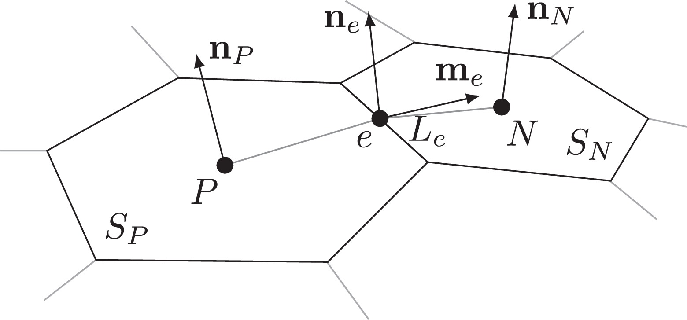
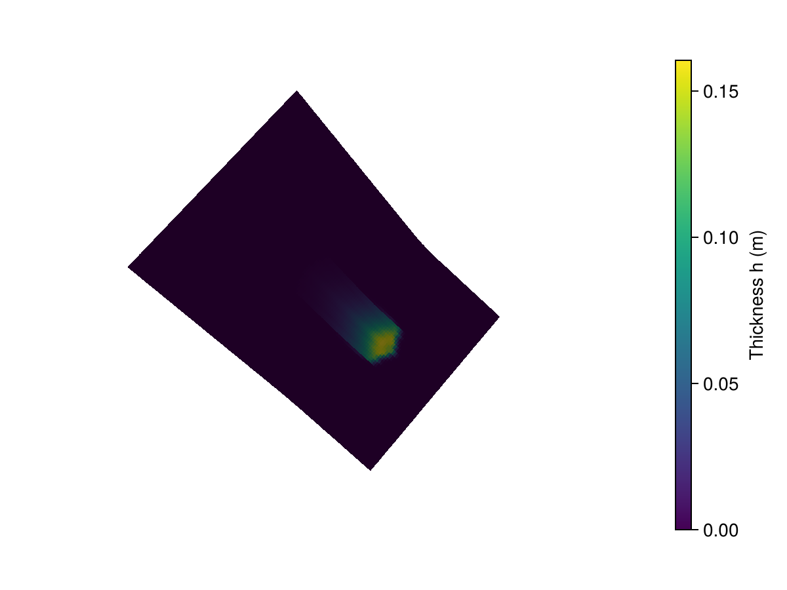
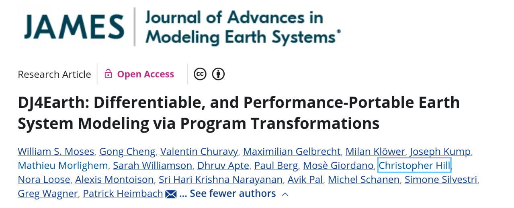
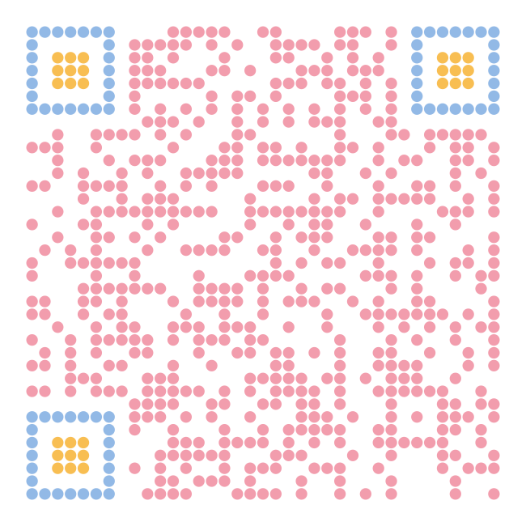

## How Spherical is the Earth?

Topographic Uncertainty


<p style="font-size: 0.5em; opacity: 0.7;">Left: NASA Blue Marble, Wikimedia Commons. Right: Geoid height (EGM2008, nmax=500), P. Bezděk, Astronomical Institute, Czech Academy of Sciences.</p>

::: {.notes}
NASA Blue Marble (left, background removed) vs. EGM2008 geoid height (right, exaggerated). Until we had a precise measurement of the geoid, the Earth's true shape was represented as a sphere plus some uncertainty around it. Once we measured it directly, that uncertainty collapsed into known geometry.
:::

## Modeling and Simulation for Geohazards

::: {.columns}

::: {.column width="33%"}
::: {.geohazard-source}
https://www.theuiaa.org/
:::
::: {.geohazard-img}

:::
::: {.geohazard-caption}
Avalanches
:::
:::

::: {.column width="33%"}
::: {.geohazard-source}
https://www.bgs.ac.uk/
:::
::: {.geohazard-img}

:::
::: {.geohazard-caption}
Landslides
:::
:::

::: {.column width="33%"}
::: {.geohazard-source}
https://www.thenationalherald.com/
:::
::: {.geohazard-img}

:::
::: {.geohazard-caption}
Flash Floods
:::
:::

:::

::: {.fragment style="text-align: center;"}
{width=90%}

<p style="font-size: 0.5em; opacity: 0.7; text-align: right;">Hazard-map result: [@zhao2020]</p>
:::

::: {.notes}
- Avalanches, landslides, and floods threaten infrastructure and lives. Hazard maps and inundation forecasts guide where we build and how we evacuate.
- Simulators like OpenFOAM-Avalanche, AvaFrame, and r.avaflow already produce these forecasts, and they're solid tools.
- What they can't do well: tell you how sensitive their prediction is to a parameter you're unsure about, or fit that parameter to observed data, without brute-forcing it one run at a time.
:::

## The Challenge

Uncertainty Informed Predictions

::: {.columns .challenge-row}

::: {.column width="45%"}
::: {.challenge-flow}


:::
<p style="font-size: 0.5em; opacity: 0.7;">OpenFOAM-Avalanche [@rauter2018]</p>
:::

::: {.column width="55%"}
::: {.challenge-box-flex}
::: {.challenge-box .fragment}
::: {.challenge-header .header-blue}
Monte-Carlo (MC) Method
:::
::: {.challenge-body}
- [+]{.pos} Arbitrary input distributions
- [-]{.neg} Curse of dimensionality
- [-]{.neg} Multiple simulation runs required
- [-]{.neg} Resource and time intensive
:::
:::

::: {.challenge-box .fragment}
::: {.challenge-header .header-purple}
Surrogate Model
:::
::: {.challenge-body}
- [+]{.pos} Reduced resource usage & time
- [-]{.neg} Parametrized by few inputs
- [-]{.neg} New geometry requires retraining
- [-]{.neg} Infeasible to fully parametrize
:::
:::
:::
:::

:::

## Research Question

::: {.problem-flow-wrap}
{width=100% fig-align="center"}
:::

::: {.research-row}
::: {.research-sigma}
$\sigma^2_{\text{Inputs}}$
:::

::: {.question-banner}
How can we propagate uncertainties in high-dimensional inputs through the computational model?
:::

::: {.research-sigma}
$\sigma^2_{\text{Output}}$
:::
:::

::: {style="text-align: center;" .fragment}
[Resource Efficient]{.badge-pill}
:::

## First-Order Second-Moment Method


$$
\text{Var}(F(X_1, \dots, X_N)) = \sigma_F^2 \approx \mathbf{g}^T \, \Sigma \, \mathbf{g}
$$

$$
\Sigma = \text{Cov}(X_1, \dots, X_N)
$$

$$
\mathbf{g} = \left[ \frac{\partial F}{\partial \mathbb{E}(X_1)}, \dots, \frac{\partial F}{\partial \mathbb{E}(X_N)} \right]^T
$$


::: {.columns}

**Computing Gradients: $\mathbf{g}$**

::: {.column width="38%"}

* Finite Differencing
  - Curse of dimensionality
  - Inaccurate or unstable

:::

::: {.column width="62%"}

* Algorithmic/Automatic Differentiation (AD)
  - Accurate up to machine precision
  - Forward Mode (Tangent): $n_{\text{inputs}} \ll n_{\text{outputs}}$
  - Reverse Mode (Adjoint): $n_{\text{inputs}} \gg n_{\text{outputs}}$

:::

:::


## GlissADe.jl {.title-slide background-gradient="linear-gradient(135deg, #1a1a1a, #2c2440, #1a1a1a)"}

## The Mathematical Model

::: {.columns}
::: {.column width="50%"}
{width=55% fig-align="center"}
:::
::: {.column width="50%"}
{width=55% fig-align="center"}
:::
:::

$$
\frac{\partial h}{\partial t} + \nabla \cdot (h\bar{u}) = 0 \;
$$
$$
\frac{\partial h\bar{u}}{\partial t} + \xi\;\nabla_s\cdot (h\bar{u}\bar{u}) = -\frac{1}{\rho}\tau_b + h\textbf{g}_s -\frac{\alpha}{\rho}\;\nabla_s (hp_b) \;
$$
$$
\xi\;\nabla_n\cdot(h\bar{u}\bar{u}) = h\textbf{g}_n - \frac{\alpha}{\rho}\nabla_n(hp_b) - \frac{1}{\rho}\;\textbf{n}_b\;p_b \;
$$
<p style="font-size: 0.5em; opacity: 0.7;">Surface-aligned, depth-integrated Savage-Hutter equations [@rauter2018]</p>


## Implementation

::: {.columns .challenge-row}

::: {.column width="33%" .fragment}

::: {.challenge-header .header-blue}
Spatial Discretization
:::

{width=95% fig-align="center"}

<p style="font-size: 0.5em; opacity: 0.7;">[@rauter2018]</p>

::: {style="font-size: 0.65em;"}
- Cell-centered fields on an unstructured mesh
- Edge values are computed from neighbouring cells, upwind or central
:::

:::

::: {.column width="40%" .fragment}

::: {.challenge-header .header-purple}
Implicit Time Stepping
:::

```{mermaid}
%%{init: {'theme':'neutral', 'themeVariables': {'fontSize': '13px'}}}%%
flowchart TD
    Init[Solver Initialization]
    P[Solve Pressure Constraint]
    M[Solve Momentum Equation]
    H[Solve Thickness Equation]
    R{residual < tol?}
    Init --> P --> M --> H --> R
    R -->|No| P
    R -->|Yes, next timestep| Init
```

:::

::: {.column width="32%" .fragment}

::: {.challenge-header .header-purple}
Explicit Time Stepping
:::

```{mermaid}
%%{init: {'theme':'neutral', 'themeVariables': {'fontSize': '13px'}}}%%
flowchart TD
    Init[Solver Initialization]
    S[Evaluate Stage Derivatives]
    C[Combine Stages, Update State]
    Init --> S --> C
    C -->|Next timestep| Init
```

:::

:::

## Differentiability

::: {.columns .challenge-row}

::: {.column width="50%"}

::: {.fragment}
::: {.challenge-header .header-blue}
Mechanism
:::

::: {.diff-body}
- Geometry and state each carry their own type:
:::

::: {.diff-code}
```julia
struct Cell{T,S,W}
    center::Vector{T}
    neighbours::Vector{S}
    h::W
    vel::Vector{W}
    pb::W
end
```
:::
:::

::: {.fragment}
::: {.diff-body}
- Swap `Float64` for `ForwardDiff.Dual` in `T` or `W`:
:::

::: {.diff-code}
```julia
preprocess(points, faces, Float64)
preprocess(points, faces, ForwardDiff.Dual)
```
:::
:::

::: {.fragment}
::: {.diff-body}
- Custom chain-rule for the linear solve, reusing one factorization per direction [@martinsning2021]:
:::

$$
A\,\dot{x} = \dot{b} - \dot{A}\,x
$$
:::

:::

::: {.column width="50%"}

::: {.fragment}
::: {.challenge-header .header-purple}
Capability
:::

::: {.diff-body}
- Sensitivity to initial conditions or model parameters:
:::

::: {.diff-code}
```julia
ForwardDiff.gradient(avgThickness, [h0])
```
:::
:::

::: {.fragment}
::: {.diff-body}
- Sensitivity to the mesh itself, one vertex at a time:
:::

::: {.diff-code}
```julia
ForwardDiff.gradient(avgThickness, vertex_coords)
```
:::

::: {.diff-aside}
Caveat: differentiating w.r.t. vertex coordinates is slow due to ForwardDiff.
:::
:::

::: {.fragment}
::: {.diff-body}
- Plug $\mathbf{g}$ into FOSM for forward uncertainty propagation:
:::

::: {.diff-code}
```julia
g = ForwardDiff.gradient(avgThickness, [h0])
sigma_Y = g' * sigma_x * g
```
:::
:::

:::

:::

::: {.diff-callout .fragment}
Computed gradients were checked against central finite differences.
:::

## Showcase

::: {.columns}

::: {.column width="50%"}
<!-- TODO: simpleslope simulation snapshot, release area matching findRegularPolygon([5.0, 10.0, -6.0, 6.0]) -->

:::

::: {.column width="50%"}
<!-- TODO: replace with sweep over h0 (initial release height) on the simpleslope case, average thickness at t = 15s, plus AD tangent line -->

:::

:::

::: {.notes}
Left: a run of the simpleslope case, this is what we're actually simulating. Right: sweep the initial release height h0 and track average thickness at t = 15s. Overlay the AD gradient at nominal h0 as a tangent line to show it matches the sweep locally, that's the payoff of forward-mode AD: one solve gives you the exact local sensitivity instead of needing the whole sweep. To be clear about scope: this is a sensitivity study of an initial condition, not a full uncertainty quantification of terrain. That's further out, see the roadmap.
:::

## Roadmap

::: {.columns .challenge-row}

::: {.column width="50%"}

::: {.fragment}
::: {.challenge-header .header-blue}
Today
:::
::: {.diff-body}
- Forward-mode only, feasible only for a small number of parameters, not for thousands of mesh nodes
:::
:::

::: {.fragment}
::: {.diff-body}
- Linear solve: single core, sequential Krylov + ILU
:::
:::

::: {.fragment}
::: {.diff-body}
- Working prototype, not production
:::
:::

:::

::: {.column width="50%"}

::: {.fragment}
::: {.challenge-header .header-purple}
Next
:::
::: {.diff-body}
- Geometric UQ: raster DEM vs. unstructured mesh
:::
:::

::: {.fragment}
::: {.diff-body}
- Reverse-mode AD via `Enzyme.jl`, checkpointed with `Checkpointing.jl` [@moses2026dj4earth]
:::
:::

::: {.fragment}
::: {.diff-body}
- `Reactant.jl` compilation for acceleration
:::
:::

:::

:::

::: {.columns .fragment style="margin-top: 0.3em; display: flex; align-items: center;"}

::: {.column width="75%"}
{width=100%}
:::

::: {.column width="25%"}
---

`Oceananigans.jl`

`ShallowWaters.jl`

`SpeedyWeather.jl`

`DJUICE.jl`

---

:::

:::

##

::: {.thank-you-row}

::: {.thank-you-faces}


:::

::: {.thank-you}
Thank You!
:::

::: {.qr-code}


GlissADe.jl
:::

:::

::: {.acknowledgements}
Financial support from the Deutsche Forschungsgemeinschaft (DFG) through grant IRTG-2379 is gratefully acknowledged.
:::

### References

::: {#refs}
:::
